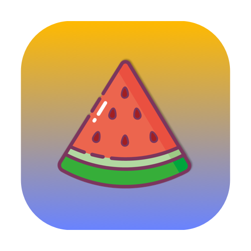

# FancyTool

=14-green">

FancyTool 是一款优雅高效的 Mac 菜单栏应用，您可以在这里免费下载使用。

#### 核心功能亮点

🚀 智能CPU动态图标
让性能可视化！
将任何GIF图片设置为你的菜单栏图标，它的播放速度会实时响应你的CPU使用率。
空闲时悠然自得，高负荷时急速狂飙，用最酷的方式监控系统状态。
支持完全自定义上传，打造你的专属动画！

🌈 渐变彩色心情签名
用美丽的渐变色彩表达每日心情状态
完全可自定义的颜色和文字，展现独特个性
为您的菜单栏增添一抹艺术气息

📋 高效剪切板管理
记录多次复制历史，随时找回需要的内容
智能分类整理，快速定位所需片段
支持文本、图片等多种格式，提高工作效率

🖥️ 屏幕圆角美化
为Mac屏幕添加优雅圆角，提升视觉美感
智能适配多显示器设置，每块屏幕完美呈现
无性能影响的背景运行，细腻改善视觉体验

📎 菜单栏折叠工具
自动整理拥挤的菜单栏图标，保持界面整洁
一键展开/折叠，平衡简洁与便捷
自定义排序和分组，完全按您的方式组织

#### 技术特点

原生 Swift 开发，完美兼容最新系统
轻量级设计，资源占用极低
直观易用的界面，无需学习成本
定期更新，持续改进功能和体验

#### 使用方法

#### 赞赏
如果觉得有用，可以请我喝杯咖啡☕️

